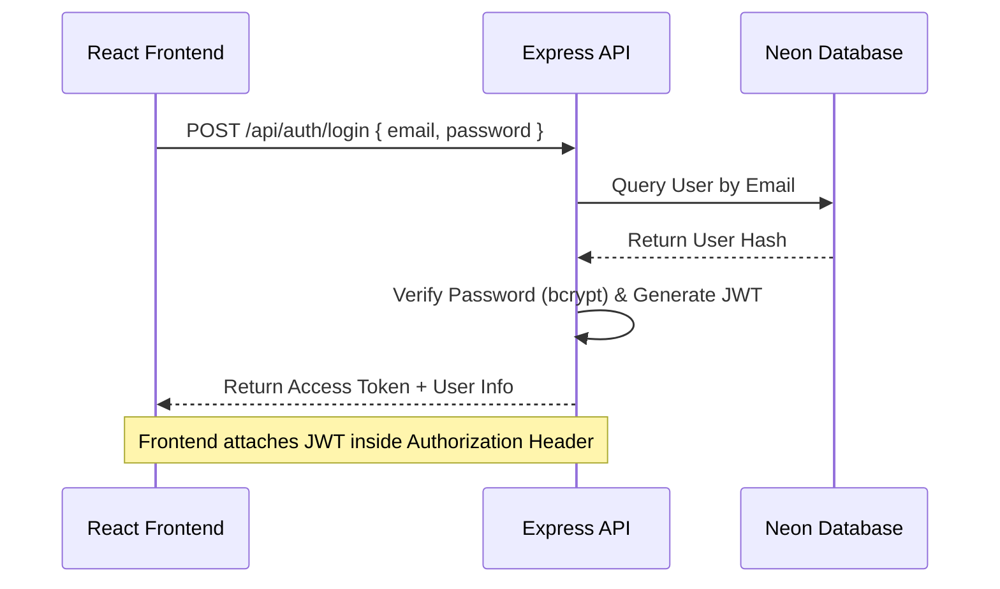

# Product Review and Feature Discovery Report

This report evaluates the full-stack Project Management System (React, Redux, Express, Prisma, PostgreSQL/Neon) from a product-focused engineering perspective, identifying architecture gaps and proposing prioritized enhancements.

---

## 1. Executive Summary & Tech Stack Alignment
* **Current Stack:** React 18, Vite, Tailwind CSS, Redux Toolkit (with `createAsyncThunk` integrations), Node.js/Express backend, Prisma ORM, Neon Serverless PostgreSQL.
* **Core Value Proposition:** A high-speed, collaborative task and project management suite (featuring Kanban boards, calendars, and performance analytics).
* **Primary Gaps:** The transition from a local-only SPA to a database-backed SaaS is incomplete. The codebase currently lacks multi-tenant isolation, real user authentication, real-time collaboration, and persistence for subtasks/comments.

---

## 2. Prioritized Enhancements List

| Priority | Enhancement | One-Line Rationale |
| :--- | :--- | :--- |
| **High** | **User Authentication & Multi-Tenancy (JWT/Bcrypt)** | Essential to isolate workspace data and secure user operations. |
| **High** | **Task Checklist Subtasks & Comments Database Persistence** | Gaps in schema prevent users from saving subtasks or comments to the DB. |
| **Medium** | **Real-Time Collaboration via WebSockets (Socket.io)** | Keeps boards synchronized across multiple users instantly without manual refresh. |
| **Medium** | **Cloud-Based File Attachments (AWS S3 / Cloudinary)** | Replaces local data file paths with secure cloud file uploads. |
| **Low** | **Activity Log & Audit Trail** | Provides users visibility into who altered project statuses or reassigned tasks. |

---

## 3. Detailed Feature Specifications

### [HIGH] 1. User Authentication, Signup/Login & Multi-Tenant Isolation
* **Description:** Implement a robust JWT-based signup/login system that registers users, hashes passwords, and restricts API routes so users only see workspaces they own or belong to.



* **Acceptance Criteria:**
  - Login & Signup forms validate emails and password lengths (min 8 chars).
  - API routes verify the JWT inside the HTTP header `Authorization: Bearer <token>`.
  - Database queries only return workspaces where the user is an owner or has a `WorkspaceMember` record.
* **UI/UX Considerations:**
  - Dedicated modern landing page with floating cards and clear auth forms.
  - Automatic token expiration handling: user is logged out with a toast notification when the session expires.
* **API Design & Data Model Changes:**
  - Update `User` model in `schema.prisma`:
    ```prisma
    model User {
      id             String            @id @default(uuid())
      email          String            @unique
      passwordHash   String            // Added for auth
      name           String?
      image          String?
      createdAt      DateTime          @default(now())
      workspacesOwned Workspace[]      @relation("WorkspaceOwner")
      memberships    WorkspaceMember[]
      tasksAssigned  Task[]            @relation("TaskAssignee")
      projectsLead   Project[]         @relation("ProjectLead")
    }
    ```
  - Endpoints:
    - `POST /api/auth/register` (body: email, password, name) $\rightarrow$ Returns 201 Created.
    - `POST /api/auth/login` (body: email, password) $\rightarrow$ Returns JWT Token + User profile.
* **Implementation Effort & Risks:**
  - **Effort:** Medium.
  - **Risks:** Weak password hashing algorithms or improper payload validation could expose credentials. Data leaks might occur if route checks fail to enforce `ownerId` or membership checks.

---

### [HIGH] 2. Checklist Subtasks & Comments Persistence
* **Description:** Add database backing for subtask checklists and conversations within tasks.

* **Acceptance Criteria:**
  - User can toggle subtask completion checkbox; state updates instantly in Neon.
  - Users can submit comment text; comment appears immediately in the task detail sidebar.
* **UI/UX Considerations:**
  - Micro-animations (pulses or strikethrough transitions) when checking off subtasks.
  - Auto-scrolling comment window to the newest message.
* **API Design & Data Model Changes:**
  - Update `schema.prisma` to add `Subtask` and `Comment` models:
    ```prisma
    model Subtask {
      id          String   @id @default(uuid())
      title       String
      isCompleted Boolean  @default(false)
      taskId      String
      task        Task     @relation(fields: [taskId], references: [id], onDelete: Cascade)
      createdAt   DateTime @default(now())
    }

    model Comment {
      id        String   @id @default(uuid())
      content   String
      taskId    String
      task      Task     @relation(fields: [taskId], references: [id], onDelete: Cascade)
      authorId  String
      author    User     @relation(fields: [authorId], references: [id])
      createdAt DateTime @default(now())
    }
    ```
  - Endpoints:
    - `POST /api/tasks/:taskId/subtasks` (body: title)
    - `PATCH /api/subtasks/:subtaskId` (body: isCompleted)
    - `DELETE /api/subtasks/:subtaskId`
    - `POST /api/tasks/:taskId/comments` (body: content)
* **Implementation Effort & Risks:**
  - **Effort:** Small.
  - **Risks:** Cascade delete cascades are required to prevent orphaned database records when deleting parent tasks.

---

### [MEDIUM] 3. Real-Time Collaboration via WebSockets
* **Description:** Sync dashboard Kanban movements and task status updates globally between collaborators using WebSockets.

* **Acceptance Criteria:**
  - If Member A moves Task X to "IN_PROGRESS", Member B sees the card move on their monitor in real time without refreshing.
* **UI/UX Considerations:**
  - Brief border highlighting/flash on the modified card for other users, making updates visually noticeable.
* **API Design & Data Model Changes:**
  - Standard Socket.io initialization in Node.js server.
  - Join channel rooms named after workspace IDs: `socket.join(workspaceId)`.
  - Emit message when task updates: `io.to(workspaceId).emit('task_updated', task)`.
* **Implementation Effort & Risks:**
  - **Effort:** Medium.
  - **Risks:** Race conditions if two users edit the same card simultaneously. Event loops could freeze if web socket connection state is handled poorly in React hooks.

---

## 4. Automated Testing Strategy

To guarantee regression-free releases, we recommend implementing tests at three levels:

### 1. Unit Tests (Frontend) - Redux Slice Reducers
Validate state mutations on API actions using Jest:
```javascript
import workspaceReducer, { setCurrentWorkspace } from './workspaceSlice';

test('should handle setting the current workspace', () => {
    const initialState = {
        workspaces: [{ id: 'w1', name: 'Alpha' }, { id: 'w2', name: 'Beta' }],
        currentWorkspace: null
    };
    const nextState = workspaceReducer(initialState, setCurrentWorkspace('w2'));
    expect(nextState.currentWorkspace.name).toBe('Beta');
});
```

### 2. Integration Tests (Backend) - POST /api/projects
Validate payload sanitization and database creation using `supertest`:
```javascript
import request from 'supertest';
import app from '../index';

describe('POST /api/projects', () => {
    it('should block creations that lack a workspaceId', async () => {
        const res = await request(app)
            .post('/api/projects')
            .send({ name: 'Invalid Project' });
        expect(res.statusCode).toEqual(500);
        expect(res.body.error).toBeDefined();
    });
});
```

### 3. End-to-End (E2E) Tests - Kanban Drag & Drop
Validate card moving interactions using Playwright:
```javascript
test('should drag task card from TODO column to IN_PROGRESS column', async ({ page }) => {
    await page.goto('http://localhost:3000/projectsDetail?id=test-project');
    const card = page.locator('[data-testid="task-card-todo"]').first();
    const dropTarget = page.locator('[data-testid="column-in-progress"]');
    
    await card.dragTo(dropTarget);
    await expect(page.locator('[data-testid="column-in-progress"]').locator(card)).toBeVisible();
});
```

---

## 5. Security, Observability & Performance Checks

### Observability
* **Logging:** Configure `winston` or `pino` structured log outputs on the backend instead of using raw `console.log`.
* **APM Monitoring:** Integrate Sentry to automatically collect frontend React stack traces and backend Express exceptions in production.

### Security
* **SQL Injection Protection:** Prisma Client naturally parameters queries, preventing SQL injections. Ensure no raw raw query interpolation is introduced.
* **CORS Limits:** In production, change `app.use(cors())` to restrict calls to defined client domains.
* **HTTP Headers:** Add `helmet` middleware to set standard secure headers (HSTS, Content-Security-Policy).

### Performance
* **N+1 Queries:** Be cautious when fetching nested models with Prisma client. If performance degrades, use selective `.findMany({ select: ... })` to avoid fetching unused details.
* **Connection Pooling:** Use Prisma's connection pooling options in database strings (like Neon pooling parameters) to avoid running out of pool connections during concurrent traffic.

---

## 6. Implementation Plan & Milestones

1. **Milestone 1: Security & Multi-Tenancy (1 Week)**
   - Add auth schema fields, password hashing, JWT signing routes, and verify tokens in middleware.
   - Restrict API queries to scope resources by token-provided User IDs.
2. **Milestone 2: Database Model Expansions (0.5 Week)**
   - Implement database models for checklists and comments.
   - Refactor frontend dialogs/sidebars to dispatch these updates to the database.
3. **Milestone 3: Socket Integration & Polish (1 Week)**
   - Wire up Socket.io connections for real-time board synchronizations.
   - Run security and performance audits.

---

## 7. Sample GitHub Issue Template (Highest-Priority Feature)

```markdown
### Feature Request: JWT Authentication & Workspace Isolation

#### Description
We need to add authentication to the application to support multi-tenancy. Right now, there is a single hardcoded user, and any workspace data is publicly accessible to any API client.

#### Tasks
- [ ] Add passwordHash, salt, or auth provider integrations to the `User` model.
- [ ] Implement backend auth endpoints: `POST /api/auth/register` and `POST /api/auth/login`.
- [ ] Implement a backend middleware `requireAuth` that decodes JWTs from the request headers.
- [ ] Refactor all workspaces endpoints (`GET /api/workspaces`, etc.) to filter items by the user ID decoded from the token.
- [ ] Create Frontend Login & Sign Up pages and hook them to the Redux state.
- [ ] Create a Redux Auth Slice and route guards in `App.jsx` to redirect unauthenticated visitors to `/login`.

#### Acceptance Criteria
- Visitors cannot access `/` or `/projects` without logging in.
- Passwords are securely stored in the DB using bcrypt hashing (min 10 salt rounds).
- Users can only query, edit, or delete workspaces that they own or are members of.
```

---

## 8. Requirements for Further Customization
If you'd like me to write the complete code for any of these specs, please provide:
1. **Your Auth Preference:** Let me know if you want to implement local email/password JWT authentication manually or integrate a service like **Clerk**, **NextAuth**, or **Auth0**.
2. **Real-time Deployment Strategy:** Are you planning to host Socket.io on a serverless platform (like Vercel, which requires alternatives like Pusher/Ably) or a standard VPS/container cluster (Render, AWS ECS, Docker)?
3. **Specific File Upload Providers:** Do you prefer **Amazon S3** or **Cloudinary** for handling task files?
